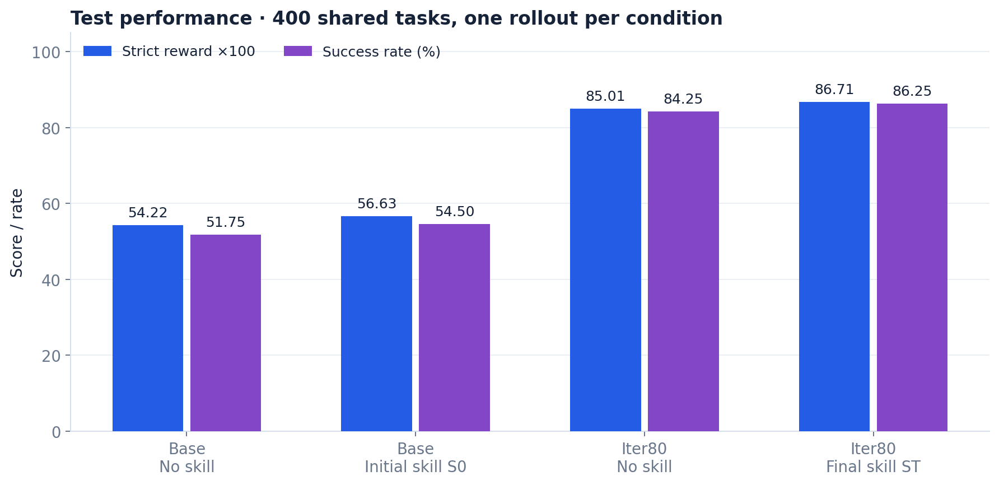
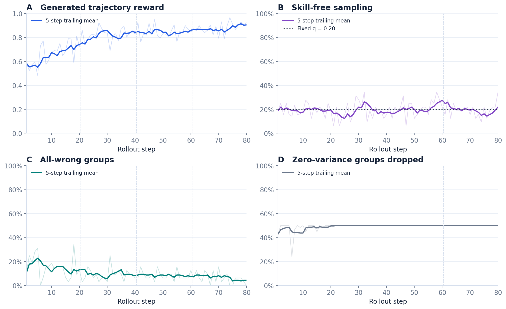

# IntraSkill

**面向购物智能体的技能与模型共同演化** · ShopSimRL

[English](README.md) · [简体中文](README.zh-CN.md) · [文档导航](docs/README.md) · [完整实验报告](docs/experiment_report.md)

IntraSkill 研究智能体策略与外部程序性指导如何共同演化。项目基于 ShopSimulator 与 slime，训练 Qwen3.5-4B 通过 function tools 搜索商品、核验规格、满足用户画像中的偏好并完成购买。

本次运行的**无技能辅助测试成功率从 51.75% 提升至 84.25%**；配备最终技能后达到 **86.25%**。这是本地协议下的一次训练结果，不能直接与上游论文的排行榜数字比较。



## 方法流程

1. **初始化购物技能。** Trace2Skill 从训练轨迹中归纳可独立遮蔽的程序性技能块。
2. **组内共享 mask 的训练。** 每个 GRPO group 包含八条轨迹，共享相同上下文。固定概率 `q = 0.20` 撤去全部技能；其余组按贡献映射得到的概率采样技能块。
3. **分析失败前沿。** 对全错组使用完整技能额外重试。重试仍失败的轨迹进入分析与归纳流程，提出 `ADD` 或 `REWRITE` 候选。
4. **每 20 个 rollout step 验证一次。** 在冻结 checkpoint 上对同一批 400 个 validation 任务运行 bare 与随机 mask 评测，用无截距 `R_i − B_i = C_iᵀβ + ε_i` 回归估计贡献，处理互斥改写版本，并在预算内保留正贡献胜出版本。

模型更新在固定上下文内比较轨迹；技能更新在冻结模型上比较干预。详见[方法草案](docs/proposal.md)与[配对验证契约](docs/paired_validation.md)。

## 已发布实验

| 模型 | 技能上下文 | Strict reward | 成功率 |
|---|---|---:|---:|
| Base | 无 | 0.5422 | 51.75% |
| Base | 初始 S₀ | 0.5663 | 54.50% |
| Iter80 | 无 | 0.8501 | 84.25% |
| Iter80 | 最终 Sₜ | 0.8671 | 86.25% |

四个条件均完成相同的 **400 个测试任务**，每任务一条轨迹。固定 persona 划分为 **train 3726 / val 400 / test 400**。本次发布包含 **四轮、80 个 rollout step**，生成 **20,480 条 episode**，其中 **10,240 条进入 trainer**。global batch size 为 64，每批保留的 128 条 episode 对应两次优化器更新；rollout step 与 optimizer update 是不同单位。



技能块数量变化为 **10 → 7 → 5 → 8 → 8**。无技能 validation 成功率从 **step 20 的 74.75% 提升到 step 80 的 86.00%**。贡献 gate 使用 val，上方四条件表使用 test。

**已支持的结论：**训练后的 checkpoint 在撤去技能时仍有明显提升；无技能成功率增益的配对 95% 区间为 **+27.50 至 +37.50 个百分点**。

**仍待验证：**最终技能额外提高 **2.00 个百分点**，但配对 95% 区间为 **−0.50 至 +4.75**。本次发布没有普通 GRPO、固定技能、无 mask 或多训练种子对照。排序附录也未确立有效性：base 模型的 top4 / bottom4 / 一个 random4 子集成功率分别为 51.75% / 55.00% / 54.25%。现有结果不能分离共同演化相对普通 RL 的因果收益。

## 行为与优化分析

分析覆盖 **110,997 个训练 turn**、20,480 条生成轨迹及 3,600 条完成评测。在固定 400 任务 bare validation 上，Base → Iter80 的平均每步生成由 **282.39 降至 159.46 token（−43.5%）**。模型步数由 6.01 降至 5.56，但配对区间跨零。成功训练路径维持约 4.5–4.8 步，剩余失败更长、搜索更多；无效环境动作减少，协议解析错误却有所增加。

四个完整 W&B history 补充了 **160 次优化器更新**，与本地日志重叠的 3,118 个数值完全一致。报告将 token 熵、PPO 诊断、梯度、已接纳 Sample 长度与吞吐，同 episode 行为分开解释。

详见[行为分析](docs/behavior_analysis.md)与[优化分析](docs/optimization_analysis.md)。双语项目页包含六个完整研究章节、交互式行为浏览器、全部技能版本、可搜索的源文档资料库，以及可下载的 episode/turn 数据。

## 无 GPU 复现分析

使用 Python 3.10 或更新版本：

```bash
python -m pip install -e ".[analysis,site]"
python scripts/analyze_training.py
python scripts/analyze_behavior.py
python scripts/analyze_wandb.py
python scripts/plot_training.py
python scripts/plot_behavior.py
python scripts/plot_wandb.py
python scripts/build_site.py
python scripts/check_publication.py
python -m http.server 8000 --bind 127.0.0.1 --directory _site
```

打开[本地项目页](http://localhost:8000)，可切换中英文、交互查看训练曲线、展开各版本技能和下载数据。静态产物可直接用于 GitHub Pages，见[发布说明](docs/project_page.md)。

分析从仓库中的[数值摘录](artifacts/analysis/README.md)重建，检查测试配对并重新拟合四轮贡献 gate。如果本机拥有完整 `runs/`，可执行 `python scripts/analyze_training.py --refresh-local` 更新摘录。查看与重建公开分析无需完整轨迹、模型权重、W&B 日志或 API 凭据。

## 运行智能体与训练

1. 按 [ShopSimulator 指南](ShopSimulator/README.md)准备并启动环境。`ShopSimulator/` 是普通目录，无需初始化子模块。
2. 在评测 YAML 指定的 endpoint 上加载正确的 base 或训练后权重。`checkpoint_id` 只记录来源，**不会**自动加载或核验服务中的权重。
3. 检查执行计划，然后评测：

```bash
python scripts/run_shopsimrl.py plan configs/qwen35_4b_test.yaml
python scripts/run_shopsimrl.py run configs/qwen35_4b_test.yaml
```

| 条件 | 配置 |
|---|---|
| Base，无技能 | [`qwen35_4b_test.yaml`](configs/qwen35_4b_test.yaml) |
| Base + S₀ | [`qwen35_4b_test_trace2skill_equipped.yaml`](configs/qwen35_4b_test_trace2skill_equipped.yaml) |
| Iter80，无技能 | [`qwen35_4b_test_final_free.yaml`](configs/qwen35_4b_test_final_free.yaml) |
| Iter80 + Sₜ | [`qwen35_4b_test_final_pair.yaml`](configs/qwen35_4b_test_final_pair.yaml) |

新实验应使用新的名称和输出目录，不覆盖冻结实验，也不在换权重后复用旧 manifest。GPU 训练还需要 slime/SGLang/Megatron 环境、模型权重和 analyst API，按[训练指南](docs/training.md)操作。

## 仓库结构

| 路径 | 用途 |
|---|---|
| `shopsimrl/` | Runtime、评测、课程、训练适配、Trace2Skill |
| `ShopSimulator/` | 本地环境、冻结划分、商品数据准备、轨迹回放 |
| `slime/` | 训练框架代码 |
| `configs/`、`scripts/` | 实验入口、分析与网页构建命令 |
| `artifacts/` | 冻结技能库、评测摘录、可复算分析与图表 |
| `site/` | 中英双语静态项目页源码 |
| `docs/`、`tests/` | 研究和工程文档、回归测试 |
| `runs/`、`data/` | 本地完整实验与生成数据；不入 Git |

## 来源与致谢

项目基于 [ShopSimulator](https://github.com/ShopAgent-Team/ShopSimulator)、[slime](https://github.com/THUDM/slime) 与 Qwen3.5，使用 Trace2Skill 风格的分析流程。本地环境对上游进行了修改，奖励与 observation 契约见 [ENVIRONMENT.md](ShopSimulator/docs/ENVIRONMENT.md)。

已发布的 S₀ 从冻结上下文中恢复，没有使用测试结果重新选择。[恢复 manifest](artifacts/cold-start/recovery_manifest.json)不能视为新完成的校准实验。历史产物保留原样，解释和复用前请参阅[来源说明](docs/provenance.md)。
