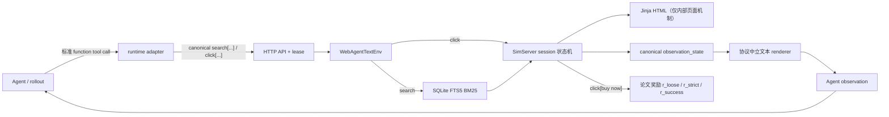

# ShopSimulator 环境实现说明

## 当前版本的边界

当前环境版本是 `shopsimulator-paper-aligned-v8`。目标是恢复论文中的任务、奖励和终止思路，并修复公开代码中影响运行和复现的问题；它不包含 Reward v3 的替代商品分档、主动放弃奖励、Gold 购买跃迁、候选资格或无进展终止设计。v2 将 API 顶层主奖励从 `r_loose` 切换为 `r_strict`；v3 收紧 Agent 动作协议，搜索栏只对应 `search[...]`，并移除当前冻结商品数据无法提供有效新信息的 Description、Features 和 Reviews 入口；v4 删除数据中不存在的 WebShop `query` 标签及其类型匹配分支，移除 WebShop 英文颜色归一化，并调整预算解析优先级；v5 要求完成全部规格轴后才能购买，为无效动作提供显式反馈，并使用原始轴名区分规格动作；v6 将搜索升级为 `shopsimulator-multifield-bm25-v3`，修复 FTS5 列权重错位，并移除规格索引中的爬取元数据；v7 弃用 HTML 展平后的 `instruction` 页面路线，以 `observation_state` 作为唯一公开页面状态，并由确定性 renderer 生成 Agent 可见的 `observation`；v8 增加显式 runner 终止原因，区分 `action_limit` 与模型生成达到长度上限的 `generation_length`，二者均由环境返回标准零分 reward。

保留的工程改进有三类：用 SQLite FTS5 多字段 BM25 替代不可直接运行的 Java/Lucene 链路；从用户指令和所选 SKU 解析价格；用结构化 observation、环境槽 lease 和稳定切分支持训练与并发评测。这些改进不改变论文奖励公式。

## 运行闭环

环境不访问真实电商网站。商品、任务、搜索结果和页面内容都来自本地商品快照。



所谓“页面跳转”是内存中的 URL、HTML 和 session 状态转换，不依赖 Selenium、Chrome 或网络。搜索从完整商品 JSON 构建的 SQLite 索引取回 ASIN；详情页、规格、翻页、返回搜索和购买都由 session 状态机处理后重新渲染 HTML。HTML 只服务于现有状态机和模板，不再被展平后交给 Agent。Agent 唯一看到的页面内容是公开 `observation_state` 的确定性文本投影，不能任意读取或修改底层商品 JSON。

`observation_state` 是页面事实和可执行动作的唯一公开来源。API 同时返回 `observation_state` 及其规范文本 `observation`；后者只能由 `render_observation_state()` 生成，不允许调用方再从 HTML 或其他私有字段拼接第二套页面。当前 schema 是 `shopping-observation-v7`；版本只保存在结构化状态和轨迹元数据中，不再写入模型可见正文。文本 observation 只描述页面能力、可点击元素和交互结果，不呈现 `search[...]` / `click[...]` 调用语法。旧的 `instruction` 页面字段、`[SEP]` 展平格式和手工追加调用协议的路线已从 API、采样器与参考评测器删除。

模型侧使用标准 function tool calling，runtime 每轮根据 `observation_state` 动态提供：

- `search(query: string)`
- `click(value: enum)`，其中 enum 只包含当前页面可点击值

一次调用只允许一个工具。runtime 将标准 tool call 转换为环境内部的 canonical `search[keywords]` / `click[value]` 字符串。搜索首页通过 `search_available=true` 表示可以提供 `search` 工具，搜索提交按钮不会进入 `click` 的 enum。商品页通过 `selected_options`、`missing_option_axes` 和 `options_complete` 公开规格状态；只有 `options_complete=true` 时，`buy now` 才会进入 `click` 的 enum。无效动作不改变页面但照常计步，并通过 `action_feedback` 和 observation 的交互结果返回 `invalid_format`、`search_unavailable`、`already_selected`、`incomplete_options` 等原因。

规格轴使用商品数据中的原始名称，不做 `颜色分类 → color` 一类轴名归一化。轴限定动作避免不同轴具有相同选项文本时发生覆盖。当前冻结商品数据的 `full_description` 与标题完全重复，且没有 `small_description` 或评论数据，因此商品页不提供 Description、Features、Reviews 动作；这三项 WebShop 遗留入口不会消耗 Agent 的动作预算。

`reset`、槽位释放和评测器截断是 rollout 控制接口，不是 Agent 工具。环境没有 `finish` 动作。并发 rollout 多于环境槽位时，额外的 `reset` 请求在槽池条件变量上排队，并在已有 episode 释放槽位后继续；槽位暂时耗尽不是轨迹失败。

## 关键目录和脚本

- `shop_env/shop_env/pack_api.py`：Flask 服务、环境槽池、lease 校验和健康检查。
- `shop_env/shop_env/debug_ui/`：直接复用同一服务的 Agent 视角调试界面与实验回放盘面；启动服务后分别访问 `/debug-ui`、`/replay-ui`。
- `shop_env/shop_env/replay.py`：只读解析根目录 `runs/` 中的 manifest、summary 和 JSONL trace，以轻量索引支撑实验总览和单 episode 回放。
- `shop_env/shop_env/client.py`：训练 rollout 可复用的有状态 HTTP 客户端。
- `shop_env/shop_env/shop_agent.py`：接收 runtime 转换后的 canonical `search[...]` / `click[...]` 动作并组装 API 结果；模型侧使用标准 function tool calling。
- `shop_env/web_agent_site/envs/web_agent_text_env.py`：页面状态机、session、动作计数和内部 HTML 机制。
- `shop_env/web_agent_site/engine/observation.py`：构造 canonical `observation_state` 并渲染唯一的 Agent 文本 observation。
- `shop_env/web_agent_site/engine/search.py`：确定性的多字段 BM25/SQLite FTS5 搜索。
- `shop_env/web_agent_site/engine/goal.py`：任务目标构造和论文奖励。
- `shop_env/web_agent_site/engine/budget.py`：只从用户指令提取价格上限。
- `shop_env/web_agent_site/engine/variant_price.py`：根据已选规格解析实际购买价。
- `shop_env/scripts/build_clean_dataset.py`：过滤、价格标注和 cleaned v2 构建入口。
- `shop_env/scripts/build_project_splits.py`：从 cleaned v2 生成项目冻结的 persona train/val/test manifest。
- `shop_env/scripts/prepare_data.py`：校验商品库 SHA-256 并构建搜索索引。
- `shop_env/scripts/evaluate_search.py`：在稳定任务切分上计算 Gold-ASIN 检索代理指标。
- `shop_env/scripts/smoke_test.py`：不调用 LLM 的 reset/search/click/purchase 全链路测试。
- `shop_env/configs/environment.json`：冻结运行协议版本。
- `shop_env/configs/task_splits.cleaned.v2.json`：清洗后官方来源分组，仅用于来源追踪和构建项目 split。
- `shop_env/configs/persona_splits.v1.json`：项目冻结的 train/val/test task ID。
- `shop_env/configs/catalog_exclusions.v2.json`：695 个被过滤商品的可审计清单。

## 搜索索引契约与质量检查

当前搜索版本是 `shopsimulator-multifield-bm25-v3`。索引使用 SQLite FTS5、固定的中文二元组及拉丁字母/数字 token、多字段 BM25 和 ASIN 升序 tie-break，不依赖机器本地的分词服务。FTS5 列顺序固定为：

```text
asin UNINDEXED, title, brand, category, model, attributes, options, bullets
```

FTS5 的 `bm25()` 权重按包括 `UNINDEXED` 列在内的声明位置逐列映射。v2 只传入七个业务字段权重，导致 `title=3.0` 落到最左侧的 `asin`，后续权重整体错位，最后的 `bullets` 使用默认权重。v3 为 `asin` 显式传入 `0.0` 占位，再依次传入七个业务字段权重；索引 manifest 同时保存 `fts_columns` 与 `bm25_column_weights`，加载时检查列顺序，避免配置看似正确而运行时错配。

`options` 文档只索引 Agent 可观察和可选择的规格轴名与规格值。原始 `customization_options` 中的图片 URL、价格字符串、可用状态、变体 ASIN 等爬取或运行元数据不再进入检索。价格仍由独立的规格价格模块核验，不通过全文搜索匹配。

权重、字段提取规则或搜索版本变化后必须重建索引；旧版本 manifest 会被加载器拒绝：

```bash
cd shop_env
python scripts/prepare_data.py --force-index
```

可用固定切分运行不依赖 LLM 的离线检索检查：

```bash
cd shop_env
python scripts/evaluate_search.py --split persona_eval --workers 4
```

该脚本分别使用 `instruction_simple` 和完整 `instruction` 作为 oracle 查询，报告 Gold 商品的 `Recall@1/20/150` 与 `MRR@150`。这是用于检测索引退化的代理指标；论文奖励允许满足全部要求的非 Gold 商品成功，因此它不能替代 Agent 端到端奖励评测。

在商品 SHA-256 为 `00d5285b6aca5ade54465e1522821c869c1d5ff5cae6385cea3889a46bb26975`、来源分组 `persona_eval` 共 1274 条任务的 cleaned v2 语料上，v3 基线为：

| oracle 查询 | Recall@1 | Recall@20 | Recall@150 | MRR@150 |
|---|---:|---:|---:|---:|
| `instruction_simple` | 24.10% | 69.07% | 95.68% | 0.3536 |
| 完整 `instruction` | 49.84% | 85.71% | 95.29% | 0.6098 |

对比修复前的 v2，简化指令的 Recall@20 从 64.99% 提升到 69.07%，完整指令的 Recall@20 从 83.05% 提升到 85.71%。后续修改权重、分词或字段文档时，应至少重跑这一固定基线；是否引入稠密检索或混合召回，则应由真实 Agent 查询日志中的失败样本和端到端收益决定，而不是仅凭 Gold-ASIN 指标。

## 商品和任务数据结构

商品顶层常用字段：

- `asin`：本地稳定商品 ID，也是搜索结果中的点击值。
- `title`、`shop_name`、`category`：检索、展示和类型评分字段。冻结数据没有商品 `query` 标签；`observation_state.search_text` 仅表示 Agent 本轮输入的实时搜索文本，不是商品标注。
- `pricing`：爬取时的挂牌价或价格区间，不一定是某个可购买 SKU 的精确价格。
- `customization_options`：规格轴；每个选项通常包含 `value` 和可能的 `price`。
- `attribute`、`full_description`、`small_description`：属性和描述。
- `instructions`：由该商品生成的一个或多个购买任务。
- `user_persona`：个性化任务的用户档案，普通任务可能没有。

`instructions[*]` 的关键字段：

- `instruction`：完整目标；标准模式展示，所有模式都用它构造私有评分目标。
- `instruction_simple`：persona 模式给 Agent 的简化需求。
- `attributes`：论文属性奖励的目标属性列表。
- `instruction_options`：论文规格奖励的目标规格值。

旧的 Reward v3 会把任务标注继续“编译”为品牌、型号、数值规格等约束；当前版本已删除该约束编译层。未被论文奖励消费的标注不会偷偷成为评分门槛。

reset 返回 `task_instruction`、`observation`、可公开的 `user_persona`、无隐藏答案的 `observation_state`、`env_idx`、`lease_id`、`task_mode`、`interaction_mode` 和 `environment_version`。`task_instruction` 是本轮给 Agent 的购物需求；`observation` 是当前搜索首页的页面状态，两者不再复用同一个字段。后续 step 只返回新的 `observation` 和 `observation_state`。默认不返回完整私有目标或 `goal_options`；多轮 Shopper 模拟器可显式请求 `private_task_instruction` 和私有目标，但这些内容不应进入 Agent observation。

## 论文奖励 pipeline

只有 `click[buy now]` 会对所购商品计算正向任务奖励。设属性目标数为 $N_{att}$，规格目标数为 $N_{opt}$，命中数分别为 $M_{att}$、$M_{opt}$：

$$
R_{loose}=R_{type}\frac{M_{att}+M_{opt}+R_{price}}{N_{att}+N_{opt}+1}
$$

$$
R_{strict}=R_{type}R_{attribute}R_{option}R_{price}
$$

$$
R_{success}=\mathbf{1}[R_{type}=R_{attribute}=R_{option}=R_{price}=1]
$$

API 顶层标量 `reward` 返回 `r_strict`，供训练和主要评测直接使用；`reward_detail` 仍同时报告 `r_loose`、`r_strict`、`r_success` 和各分量，便于诊断与论文指标对照。该改动只调整主奖励选择，不改变论文奖励公式，也不引入 v3 映射。

各分量如下：

- `R_type`：类别路径至少两个节点相交或标题词重合率大于 0.2 时为 1.0；否则，标题完全无重合为 0，重合率小于 0.1 为 0.1，其余为 0.5。数据中不存在的 WebShop `query` 字段不参与评分。
- `R_attribute`：目标属性中被商品属性或标题/卖点/描述匹配的比例；`M_att` 是命中个数。
- `R_option`：Agent 已选规格值与目标规格值的匹配比例；`M_opt` 是命中个数。
- `R_price`：未声明预算时为 1；声明预算时，只有可核验的所选 SKU 价格不超过上限才为 1，否则为 0。

`target_asin_match` 仅是诊断指标，不参与三个奖励公式。因此，满足全部要求的非 Gold 商品可以获得 `R_success=1`；反之，买到 Gold ASIN 但选错规格或超预算不能成功。

标题类型匹配优先使用公开代码要求的 `zh_core_web_sm` 名词词性；模型不可用时采用确定性的字面词回退，避免整个环境无法启动。正式对比实验应在所有 worker 上固定相同依赖环境。

## 价格机制和商品过滤

商品价格是爬取快照中的既有数据，不由环境随机生成。但 `pricing=[最低价, 最高价]` 常是展示区间，不能直接说明 Agent 所选组合的成交价。当前流程是：

1. 新数据构建流程只为 persona 任务离线写入 LLM 解析的 `instructions[*].price_upper`；standard 任务显式写入 `null`。运行时仅在该字段为有效数值时直接采用，否则从 `instruction_simple` 解析并在没有结果时回退完整 `instruction`。所有路径都绝不从 Gold 商品价格反推。
2. 若没有价格变化规格轴，使用唯一的选项价或唯一挂牌价。
3. 若恰有一个价格变化轴，必须由 Agent 选择该轴的具体值，再采用该值记录的价格。
4. 原始快照没有可靠的多轴笛卡尔 SKU 价格表；有两个或更多价格变化轴时无法恢复组合价，因此整件商品在数据准备阶段删除。

原始 23,421 个商品中删除 695 个，过滤后为 22,726 个。运行时仍保留多价格轴的 fail-closed 防线，防止错误数据集悄悄使用猜测价格。预算已声明但价格不可核验时 `R_price=0`，并在 `reward_detail.price_verifiable=false` 中显式标记。

### 离线数据清洗流水线

`shop_env/scripts/build_clean_dataset.py` 是薄 CLI，核心实现位于独立的 `shop_env/data_pipeline/`。流水线先为原始任务分配稳定 `task_id`，再过滤多价格轴商品，只把仍有效的 persona 任务发送给 SiliconFlow `Qwen/Qwen3.5-27B`。原始23,421条任务过滤后共有22,726条，其中4,526条 persona 使用LLM标注，18,200条 standard 保留空值并使用运行时正则。它不会覆盖任何输入文件：

- `data/fine_items_eval_train_all.raw.json.gz`：23,421 条不可变源档案；
- `data/fine_items_eval_train_all.cleaned.v2.json.gz`：完成标注后新生成的清洗数据；
- `data/price_annotations.persona.qwen3_5_27b.v3.jsonl`：可断点续跑的 persona 标注缓存，默认不纳入 Git；
- `configs/persona_price_annotations.v2.json`：persona 预算证据的可审计副本；
- `configs/clean_dataset_manifest.v2.json`、`catalog_exclusions.v2.json` 和 `task_splits.cleaned.v2.json`：哈希、排除原因和官方来源分组的显式稳定任务 ID 清单；
- `configs/persona_splits.v1.json`：在全部4,526条cleaned persona上冻结的项目划分，train/val/test为3726/400/400。

默认命令只展示计划，不调用付费 API：

```powershell
cd ShopSimulator\shop_env
python scripts\build_clean_dataset.py
```

Windows PowerShell 中可先用隐藏输入设置临时环境变量，再请求一条数据验证账号、模型与结构化输出：

```powershell
$secret = Read-Host "SiliconFlow API key" -AsSecureString
$env:SILICONFLOW_API_KEY = [Net.NetworkCredential]::new("", $secret).Password
python scripts\build_clean_dataset.py --stage annotate --max-requests 1 --confirm-paid-api
```

单条确认无误后，去掉 `--max-requests` 完成剩余标注，再单独构建产物：

```powershell
python scripts\build_clean_dataset.py --stage annotate --confirm-paid-api
python scripts\build_clean_dataset.py --stage build
python scripts\build_project_splits.py
Remove-Item Env:SILICONFLOW_API_KEY
```

persona 的 `instruction_simple` 与完整 `instruction` 分两阶段处理：程序先只发送简化指令；只有它没有得到有效价格上限时，才发送完整指令。优先级不由模型自行决定。模型每项只返回 `task_id`、`kind`、数值型 `amount` 和原文 `evidence`；代码统一给近似预算增加10%容差。之前 v1 缓存中能按新协议严格验证的有效上限会自动导入，其他记录不会混入新缓存。

每次 HTTP 请求只包含一条 instruction，并只接收一个标注对象；不是在一个请求中塞入多条数据。`--workers` 控制最大在途并发数，默认32；另由全局 `--requests-per-minute` 控制请求启动速率，默认32条/分钟。程序先同步完成并落盘第一条健康检查，然后才放开并发。此后每条请求一完成就立即向 JSONL 追加一行，失败或中断后重跑会自动跳过已缓存的 `(task_id, source_field)`。`--max-batches` 仅作为旧命令的兼容别名保留，但现在与 `--max-requests` 一样表示最多调用多少条数据。单条请求会为每条 instruction 重复发送系统提示词，因此相较批量请求更便于隔离失败和实时保存，但输入 token 总量会更高。

SiliconFlow 的限流按账户和模型统计，可能先触发 RPM 或 TPM。所有 worker 共享同一个限速器；遇到分钟级 429 时，默认整体冷却65秒，同一波429只触发一次冷却，随后继续按全局速率发送。如果冷却后再次触发新一波429，发送速率自动减半。每条 instruction 最多允许20次分钟级限流重试，和 `--retries` 所控制的网络、5xx、结构错误重试分开计数；RPH、RPD、TPD 等长周期限额不会盲目等待。可在确认账户对应模型的限额后调高 `--requests-per-minute`，但 `--workers 32` 本身不代表平台允许持续每秒发出32条请求。

若某个 persona 标注确定不再重试，可显式传入 `--runtime-regex-task-id TASK_ID`（可重复）。该任务不会伪造 LLM 输出：清洗数据写入 `price_upper=null`，审计文件记录 `kind=runtime_regex_fallback`、缺失阶段和原因，运行时按既有的 `instruction_simple` 优先、完整 `instruction` 回退规则使用正则。未显式列出的缺失标注仍会令构建失败，避免无意间大范围降级。

构建完成并审核 manifest、预算统计和排除清单后，可显式激活新商品库并重建索引：

```powershell
python scripts\prepare_data.py `
  --archive data\fine_items_eval_train_all.cleaned.v2.json.gz `
  --dataset-manifest configs\clean_dataset_manifest.v2.json `
  --force-products --force-index
```

`prepare_data.py` 会同时核验压缩包哈希和解压后 JSON 哈希。激活命令只替换可重建的 `items_eval_train.json` 与搜索索引，不修改 raw 或 cleaned v2 压缩包。

无参数运行 `python scripts/prepare_data.py` 只接受 cleaned v2 与对应 manifest，并自动核验二者；不再静默回退旧压缩包。环境启动不选择数据 split，训练和评测代码读取 `persona_splits.v1.json` 后按 task ID 调用环境。

缓存只接受相同源档案 SHA-256、API endpoint、模型、标注协议和 prompt 哈希的记录。模型输出中的 `evidence` 必须是当前输入指令的逐字子串；“左右”等近似预算由代码统一乘以 1.10，LLM 不能自行决定奖励容差。过滤后的稳定 ID 允许出现空洞，环境通过 `goals_by_task_id` 查找目标，split 文件保存明确 ID 列表而不是重新编号后的连续区间。

## 终止和轨迹

- 购买：选完当前商品的全部规格轴后，`click[buy now]` 才可用；执行后环境立即计算奖励并令 `done=true`，终止原因为 `purchase`。
- 动作上限：当前 `shopsimrl` single-turn runtime 默认最多 30 个 Agent→环境动作；达到上限时调用环境终止接口统一生成零分终局，所有论文奖励指标为 0，终止原因为技术性的 `action_limit`。环境协议仍保留 40 步的 `multi_turn` 模式上限，但项目当前没有多轮 Shopper runner。

不存在 `finish`、`graceful_stop`、`early_abstain`、`repeat_loop`、`wrong_purchase` 等 Reward v3 终局/奖励类别。Agent runner 以环境返回的 `done` 为准，终止后不会继续调用该 session；对已终止 session 再调用 `step` 会报错。

环境在内存 session 中记录当前页面、搜索结果、所选规格、动作计数和终局明细；项目根目录的 `shopsimrl` runtime 负责把完整 step、模型元数据和终局结果逐条追加到 JSONL trace。环境服务本身不把轨迹永久写盘。

## Persona 与 `instruction_sample`

公开数据全集没有 `instruction_sample` 字段，原代码访问它会崩溃。当前契约使用 `instruction_simple + user_persona` 作为 persona 模式的可见输入，完整 `instruction` 只保留在环境内部用于评分；缺少 `instruction_simple` 时回退到完整指令。

## 项目 Persona 切分

`task_splits.cleaned.v2.json` 保存清洗后任务原本来自官方 train 还是 eval，只作为来源追踪。`build_project_splits.py` 合并全部4,526条 persona，以固定种子按 ASIN、完整/简化指令、persona 指纹和用户 ID 构造连通组，再将整组分配到 `train=3726`、`val=400`、`test=400`。大型复用 persona 组留在 train，避免单一用户主导 held-out 集。最终训练和评测只读取 `persona_splits.v1.json`，不得再使用官方 `persona_train/persona_eval` 作为项目实验划分。

## Agent、工具与后续 Skill

环境只规定动作、页面状态和评分，不绑定特定 Agent。采样和评测统一由项目根目录的 `shopsimrl` package 与 `scripts/run_shopsimrl.py` 驱动；旧 runner 已删除。

后续增加检索规划、对话、记忆或商品比较 Skill，只要仍调用现有 `search` / `click` function tools，无需修改环境和奖励。只有 Skill 确实需要新环境动作或新可观察状态时，才应另起协议版本；不要把策略偏好编译进奖励。

## 仍无法从公开资料恢复的内容

- 部分 persona 档案、目标规格和商品选项存在语义关联异常，无法从同一快照无损推回原始正确标注，只能过滤、人工复核或重新标注。
- 少数指令写的是“单价/每平方米价格”，商品选项记录的却是整包或整件总价；公开快照没有结构化数量、计价单位和换算关系，不能可靠地自动统一，相关样本仍需人工标注或维护排除清单。
- 论文口径中的 persona 训练数量与公开语料不完全一致，缺失样本无法凭代码恢复。
- `reason_key` / `__reasoning__` 在当前全集没有足够有效标注，无法重建数据生成过程中的隐式解释链；运行和评分不依赖它们。

这些问题不阻塞训练和评测。若项目后续维护人工排除清单，应把商品库清单版本、环境版本和模型 checkpoint 一起记录。
