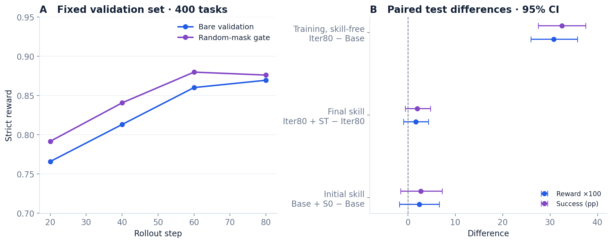
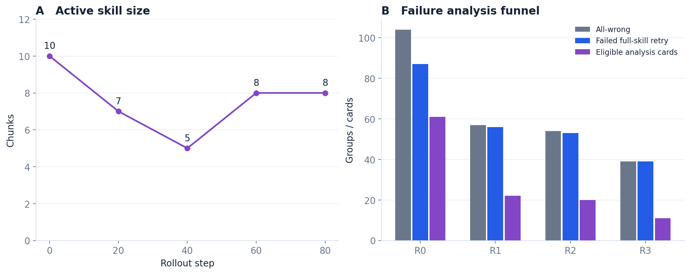
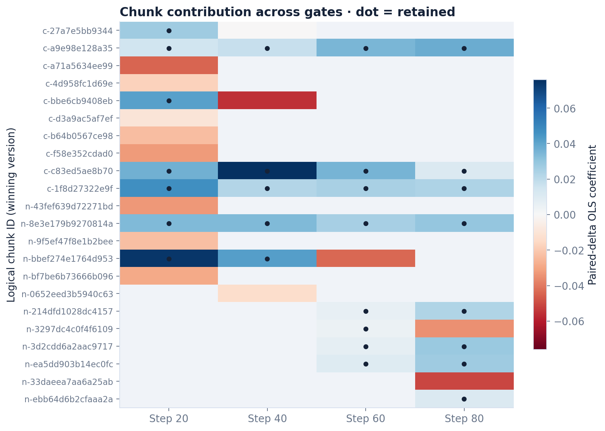
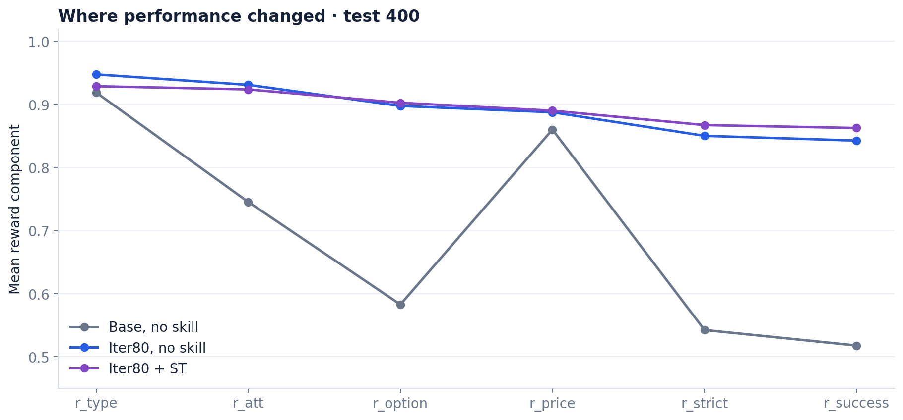

# IntraSkill：训练与评测分析

分析更新：2026-09-09。范围：冻结的 Qwen3.5-4B Iter80 四轮实验。数字由 [`analyze_training.py`](../scripts/analyze_training.py) 从原始轨迹摘录及公开 gate 观测复算；图表由 [`plot_training.py`](../scripts/plot_training.py) 生成。新增[行为分析](behavior_analysis.md)与 [W&B 优化分析](optimization_analysis.md)覆盖 110,997 个训练 turn、固定验证集配对与 160 次优化器更新。此报告描述一次训练运行，不包含新模型采样。

## 实验协议

| 项目 | 实际设置 |
|---|---|
| 环境 | ShopSimulator single-turn / persona，本地环境版本 `shopsimulator-paper-aligned-v8` |
| Observation / action | `shopping-observation-v7` / `openai-function-tools-repair-v3` |
| 模型 | Qwen3.5-4B；最终评测 ID `qwen35-4b-iter80` |
| 数据划分 | 冻结 persona train=3726、val=400、test=400 |
| 主训练范围 | rollout step 1–80，四轮，每轮 20 步 |
| Group / batch | 8 siblings；每步生成 32 groups，保留 16 groups；global batch=64 |
| 学习率 | W&B 两个 parameter groups 均为固定 1e-6，覆盖 160 次更新 |
| 样本数量 | 20,480 generated episodes；10,240 trainer-admitted episodes |
| 课程 | q=0.20 固定；rho 范围 [0.20, 0.90]，由当前正贡献线性映射 |
| 在线候选预算 | 每轮最多 6 个 ADD/REWRITE；active skill 上限 10 |
| 验证 gate | 每轮同 checkpoint 的 400 bare + 400 masked trajectories |
| 评测采样 | temperature=0.6、top_p=1.0、thinking 开启、每轮 max_tokens=4096、max_steps=30、send_seed=false |

每个 rollout batch 的 128 条训练 episode 切为两次优化器更新。因此 **80 rollout steps 不等于 80 optimizer updates**。同一 episode 还可能因工具 schema 变化分段为多个 token-contiguous Sample；样本归一化与统计按 unique rollout 去重。

## 四条件 test 结果

| 条件 | Strict reward | 成功率 | 平均模型步数 | 完成覆盖 |
|---|---:|---:|---:|---:|
| Base，无技能 | 0.542167 | 51.75% | 6.2125 | 400/400 |
| Base + S₀ | 0.566301 | 54.50% | 6.6125 | 400/400 |
| Iter80，无技能 | 0.850060 | 84.25% | 5.7525 | 400/400 |
| Iter80 + Sₜ | 0.867143 | 86.25% | 6.0100 | 400/400 |

以 task 为单位配对重采样，10,000 次 percentile bootstrap，confidence=0.95。随机数实现与现有 comparison 脚本一致，按指标名从 seed=20260901 派生种子。初始和最终技能增益区间可与发布的 `comparison.json` 对照。跨 checkpoint 的旧 `cross_checkpoint_comparison.json` 未完整记录随机数约定；报告使用本次统一复算，可能与该历史摘录端点有微小差异。

| 成功率对比 | 增益（百分点） | 配对 95% 区间 |
|---|---:|---:|
| Iter80 free − Base free | +32.50 | [+27.50, +37.50] |
| Base + S₀ − Base free | +2.75 | [−1.50, +7.25] |
| Iter80 + Sₜ − Iter80 free | +2.00 | [−0.50, +4.75] |

区间只描述本次训练运行下的任务抽样不确定性。一个任务每个条件仅一条随机轨迹，`send_seed=false`，不能把 task seed 相同解释为共享采样随机数，也不能从这些区间推断跨训练种子的稳定性。

无技能 base→Iter80 的配对变化为：139 个任务从失败变成功、9 个从成功变失败、198 个始终成功、54 个始终失败。最终 skill 相对 Iter80 bare 则修复 19 个任务、损失 11 个任务，净增加 8/400。后者的区间跨零，不宣称显著提升。

## 训练动态

浅线为原始逐步指标，实线为最多五步的 trailing mean；开头使用已有步数，轮次边界不重置平滑窗口。竖虚线标出 20-step round 边界。原始值保存在 CSV，避免平滑掩盖波动。

- reward/success 覆盖全部已完成生成中的可评分轨迹，包括随后被过滤的 groups；`train_trajectory_count` 只计算进入 trainer 的轨迹。
- 首步 scored rate 为 0.96484375，因此不可评分轨迹不能当作 reward=0；技术故障与策略失败分开。
- q 固定 0.20，实际 skill-free group rate 因组级 Bernoulli 采样而波动；rho 随每轮 gate 改变。
- zero-std drop rate 后段接近 0.5，主要受“32 组生成、保留 16 组”的过滤机制与保底凑批规则影响。它不是零方差发生率，也不能直接解释为模型有一半任务没有学习信号。
- 当前公开统计有 2,560 个 generated group，每轮 640；进入 trainer 的 group 为每轮 320。分析没有把 full-skill diagnostic retry 加到训练样本数量里。

本地 W&B 文本日志有多个进程写出的重复记录。提取按 rollout step 去重，要求重复数值完全一致。公开序列严格为 1–80。另通过 W&B API 读取四个 finished run 的完整 history，核验 3,118 个重叠数值全部一致，并按显式 train/step 重建 160 次优化器更新；不使用日志事件 `_step` 充当训练步数。

## 验证与技能演化

| Gate 后 step | Bare strict | Masked strict | Bare success | 输入 chunks | 输出 chunks | Candidates |
|---|---:|---:|---:|---:|---:|---:|
| 20 | 0.765952 | 0.791661 | 74.75% | 10 | 7 | 6 |
| 40 | 0.813119 | 0.840690 | 80.00% | 7 | 5 | 6 |
| 60 | 0.860119 | 0.879774 | 84.75% | 5 | 8 | 6 |
| 80 | 0.869417 | 0.876024 | 86.00% | 8 | 8 | 4 |

Masked validation 使用 current + candidates 的随机干预池，**不是**筛选后的完整新技能。因此 masked-minus-bare 均值不能当作最终 selected skill 的整体收益。每轮重用的固定 val 也参与技能选择，不是一个从未用于模型/技能决策的独立最终检验集。

| 轮次 | All-wrong groups | Failed retry / analyzed cards | Eligible cards | 候选数 |
|---|---:|---:|---:|---:|
| R0 | 104 | 87 | 61 | 6 |
| R1 | 57 | 56 | 22 | 6 |
| R2 | 54 | 53 | 20 | 6 |
| R3 | 39 | 39 | 11 | 4 |

All-wrong 不等于技术失败，也不等于 skill deficit。R0 的分类中共有 25 个 environment/runtime error groups，其中包括训练 siblings 的技术问题和 retry 错误；不能把 104−87 全部当作“full skill 修复成功”。实际 `model_internalization_deficit` 数为 9、1、1、0。

技能大小先收缩后扩张，与新候选的接纳共同作用；不能仅凭 chunk 数减少证明知识已内化。发布的热图以 logical chunk ID 对齐，显示每轮胜出的版本，圆点表示最终保留，空白表示该轮未评估；REWRITE loser 单独保存在明细 CSV 中。

原始技能文本见 [S₀](../artifacts/cold-start/selected_skill.md) 和 [Sₜ](../artifacts/round-003/gate/selected_skill.md)。项目页可展开全部中间版本。当前技能主要围绕查询构造、persona 属性、商品类型、规格选项和价格核验。

## 行为成本与排序附录

选项匹配等分量随训练明显改善，但并非所有指标在加 Sₜ 后都更好。Iter80 + Sₜ 的总模型步数为 2404，协议错误 276（按步比例 11.48%）；Iter80 free 为 2301 步、144 个协议错误（6.26%）。按任务平均的错误比例与总错误数/总步数不同，应明确分母。配对报告还显示 Sₜ 带来更高 prompt token 和时延；时延是本机服务条件下的观测，不能作硬件无关比较。

Base 模型的固定 k=4 排序附录：top4 strict=0.541734、success=51.75%；bottom4 strict=0.570394、success=55.00%；random4（20260907）strict=0.558851、success=54.25%。其余计划的四个 random seeds 尚未运行。排序系数来自单独的本地 base gate，不能与历史恢复 S₀ 的系数混用。本附录未确立 contribution ranking 的 held-out 有效性，也未证明反向排序更好。

## 来源、核验与限制

分析从四组完整 traces 各取唯一 completed 记录，发现 base-free 还有 21 次失败尝试；这些失败后来补测成功，不作为额外测试样本。四组最终 summary 均复算一致，且无重复 completed task。发布的数值摘录只含 task ID、条件、reward、success，不含 persona 或对话。

四轮 gate 均使用公开 `observations_table` 重拟合，设计矩阵满列秩，系数最大绝对误差小于 2×10⁻¹⁶。这验证数值产物的一致性，不替代服务权重、采样协议或数据来源的审计。

初始 S₀ 为历史冻结上下文恢复，`uses_test_outcomes=false`、`validation_refitted=false`。它不是一次新完成且满足当前全部 provenance 约束的 Gate A。完整来源说明见 [provenance.md](provenance.md)。

本次没有 plain GRPO、固定 S₀、无 mask、无在线 gate、不同 q 或多训练种子对照。结论应表述为“该训练后的模型显著优于初始模型”，而不是“共同演化已被证明优于普通 RL”。当前系数是特定 checkpoint / mask 分布下的加性拟合；交互效应、验证集复用与选择噪声仍是限制。
